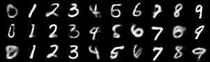

# Conditional Variational Auto-Encoder

Example implementation of a conditional variational auto-encoder. This assumes you
have [PyTorch and Torchvision](https://pytorch.org) installed.

Read the [blog post](https://tilman.xyz/understanding-cvaes/) this code complements.
